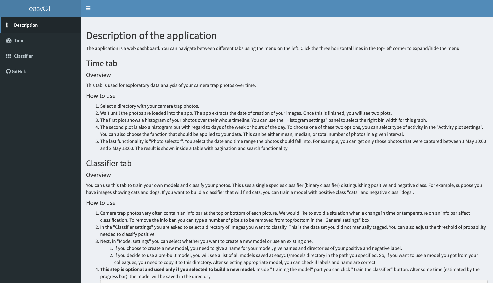
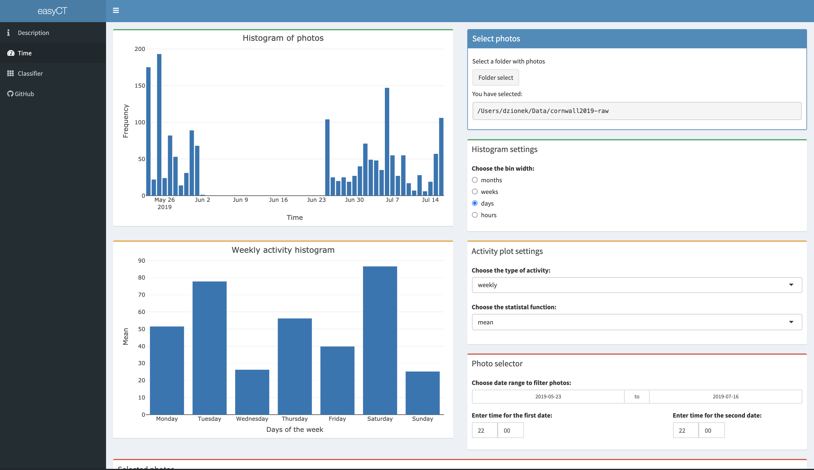
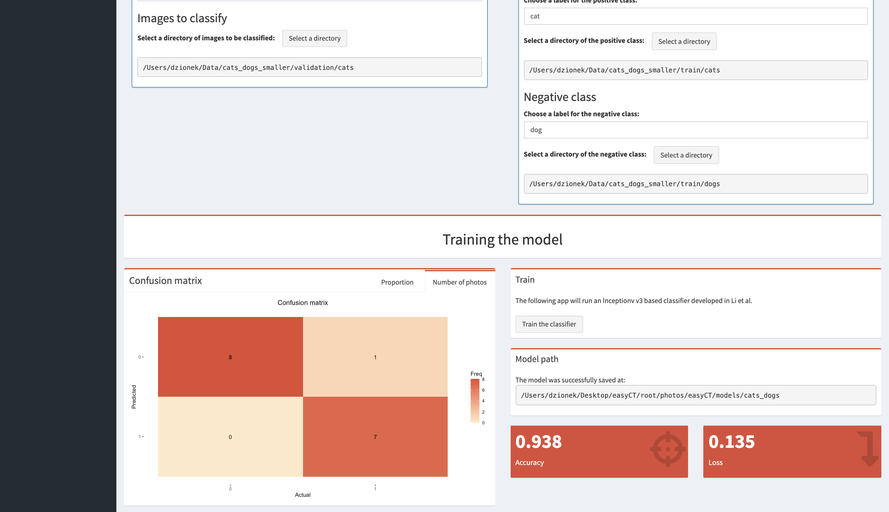
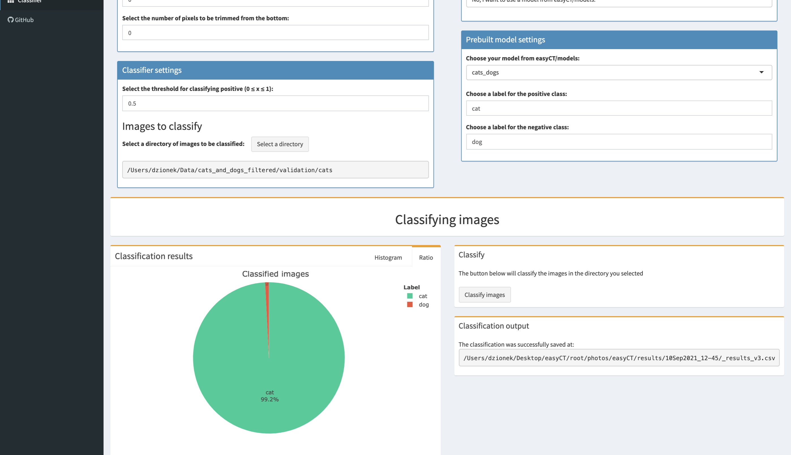

# easyCT

Camera trap data anlaysis easier than ever before thanks to machine learning classification.

<table>
 
 <tr>
  <th>
   
   <br>
   Thorough description.
  </th>
  <th>
   
   <br>
   Time analysis.
  </th>
 </tr>

 <tr>
  <th>
   
   <br>
   Training your model.
  </th>
  <th>
   
   <br>
   Classification.
  </th>
 </tr>
 
</table>

## Description

This is an application intended to run locally on your computer in a web browser of your choice. It allows you to load your photos
from a camera trap survey and analyze them using a machine learning classifier. You can also get some insight
into the distribution of your photos over time.

The app was created in [R Shiny](https://shiny.rstudio.com). It uses many R and Python libraries. [Exiftool](https://exiftool.org) is used for
extracting metadata from photos. The machine learning part is based on [Tensorflow](https://www.tensorflow.org).

## Prerequisites
**Warning**: Due to the new architecture of Apple computers (i.e. Apple Silicon M1 onwards),
they are not currently supported. If you still want to use the app on Apple Silicon, you can install
R, Python, and Perl with [Apple's Tensorflow](https://developer.apple.com/metal/tensorflow-plugin/). Then,
try following the remaining instructions in [Dockerfile](Dockerfile).

### Docker
You need to have [Docker](https://www.docker.com) installed on your machine. The way of installing it
differs depending on the operating system:

* **Docker on Windows**
  * The easiest way to use it is to download [Docker Desktop](https://www.docker.com/products/docker-desktop).
  * This is the hardest part you need to go through before using the app. Hence, make sure you familiarize
yourself with the [official manual](https://docs.docker.com/desktop/windows/install/).
  * In particual, you need to have [Virtualization](https://docs.docker.com/desktop/windows/troubleshoot/#virtualization-must-be-enabled)
enabled on your machine.
  * If you don't know what is WSL, don't select WSL2 backend while you install Docker Desktop
(choose Hyper-V backend instead).

* **Docker on Mac (Intel chip only)**
  * The easiest way to use it is to download [Docker Desktop](https://www.docker.com/products/docker-desktop).
  * For reference, check the [official manual](https://docs.docker.com/desktop/mac/install/).

* **Docker on Linux**
  * Ubuntu: Check this [official manual](https://docs.docker.com/engine/install/ubuntu/) to install Docker Engine.
  * Debian: Follow this [official manual](https://docs.docker.com/engine/install/debian/) to install Docker Engine.
  * Arch Linux: Read this [ArchWiki article](https://wiki.archlinux.org/title/docker) to install Docker Engine.

### Web browser
You must have a modern web browser to see the application (Chrome, Opera, Safari, Firefox, etc).

## Installing the app
Installation and execution is done inside a command-line interface existing inside your operating system.
If you use Windows, open Command Prompt (CMD); on MacOS and Linux open Terminal. Then, copy-paste the commands below.

**Important:** Make sure Docker is running in the background before executing the commands below.
If you have installed Docker Desktop, you need to open this application beforehand (otherwise you will
see a warning saying `the docker daemon is not running`). If you only use Docker Engine on Linux, you need to
open docker daemon in a separate terminal tab.

* First command: Pull the official image from [Docker Hub](https://hub.docker.com/repository/docker/dzionek/easy-ct):
```{bash}
docker pull dzionek/easy-ct:latest
```

This may take a while as you need to download a few gigabytes. In the meantime, you can enjoy a cup of tea or coffee.
Make sure you have enough space on your drive and you don't close the command-line interface during this process.

## Running the app

The application will run inside a virtual machine environment. This external environment doesn't normally
have access to the files stored on your machine. Hence, you need to explicitly provide the path to the directory
you want to share with the app. If you have installed Docker Desktop in the previous steps, then open Docker Desktop
and go to `Settings > Resources > File Sharing`. Then, add your path to the directory you want to share and apply changes.
In case of problems, check File Sharing manual for [Windows](https://docs.docker.com/desktop/windows/#file-sharing)
or [Mac](https://docs.docker.com/desktop/mac/#file-sharing).

* Second command: Run the image. You need to modify the part with square brackets.
Substitute `[PUT YOUR PATH HERE]` with the path containing your photo directories.

```bash
docker run -d --rm -p 3838:3838 -v [PUT YOUR PATH HERE]:/root/photos dzionek/easy-ct
```

The application will be available after about one minute at [http://localhost:3838/](http://localhost:3838/).

## Example of installing and running the app
Suppose I use Windows and have my camera trap photos stored on an external hard drive in a folder
`H:\camera_traps\site01`. I add this path inside Docker Desktop's `Settings > Resources > File Sharing`.
Then, all I need to do (for installing and running) is paste:

```bash
docker pull dzionek/easy-ct:latest
docker run -d --rm -p 3838:3838 -v H:\camera_traps\site01:/root/photos dzionek/easy-ct
```

After that, I wait 1 minute so that my application is ready. Then, I open my favourite web browser
(say Firefox) and go to the link [http://localhost:3838/](http://localhost:3838/). The photos stored at
`H:\camera_traps\site01` will be available inside `Home/photos` directory within the web application.

## Stopping the app
If you want to close the app after using it and free your computer memory, you can do this by closing Docker.
If you use Docker Desktop, make sure it is closed.

For example, on Windows, you can find Docker Desktop icon on the right side of your taskbar. If the icon
is hidden, extend the list of icons with the up arrow.

Note that when you want to open the app again, you will need to open Docker and use the command from
*Running the app* section:
```bash
docker run -d --rm -p 3838:3838 -v [PUT YOUR PATH HERE]:/root/photos dzionek/easy-ct
```

## Updating the app
If you want to update the app, you need to stop it first. Then, open Docker and use the command from
*Installing the app* section:
```bash
docker pull dzionek/easy-ct:latest
```

If your app can be updated, this will pull the latest image. If your version is up to date, you will see
`Status: Image is up to date for dzionek/easy-ct:latest`.

## Author
The project was created by Bartosz Dzionek during his Research Experience Placement 2021 at the [Zoological Society of London](https://www.zsl.org)
and [Imperial College London](https://www.imperial.ac.uk/grantham/). Many thanks to [Dr. Marcus Rowcliffe](https://www.zsl.org/science/users/marcus-rowcliffe),
[Verity Miles](https://www.imperial.ac.uk/people/v.miles20), and others for supervision and great advice.

The application is based on a binary classifier developed by the ZSL and available at [https://github.com/Zoological-Society-of-London/camtrap_classifier](https://github.com/Zoological-Society-of-London/camtrap_classifier).

## Contributing
Pull requests are welcome. You can build your Docker image locally using:

```bash
docker build -t dzionek/easy-ct:test . 
```

For major changes, please open an issue first to discuss what you would like to change.

## License

This project is licensed under the [MIT License](https://choosealicense.com/licenses/mit/) - see the [LICENSE](LICENSE) file for details.
